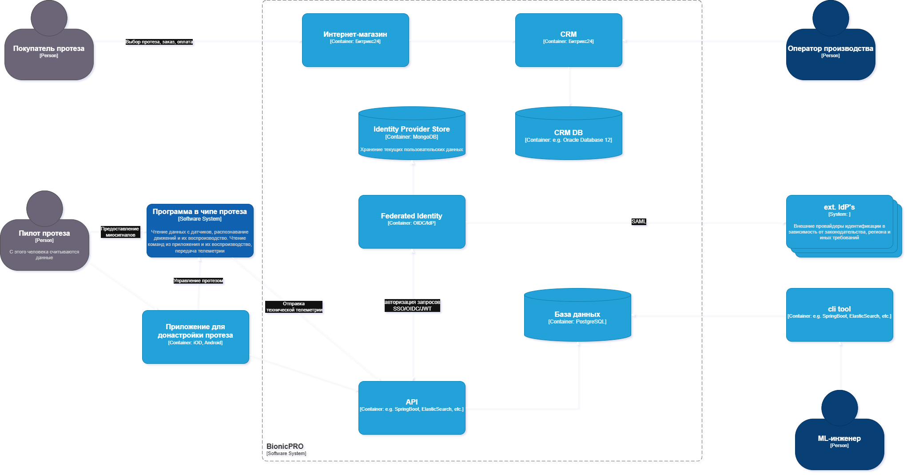
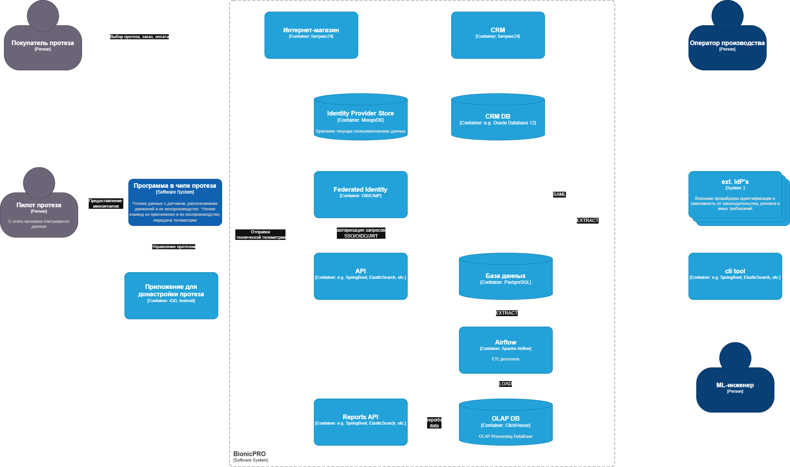
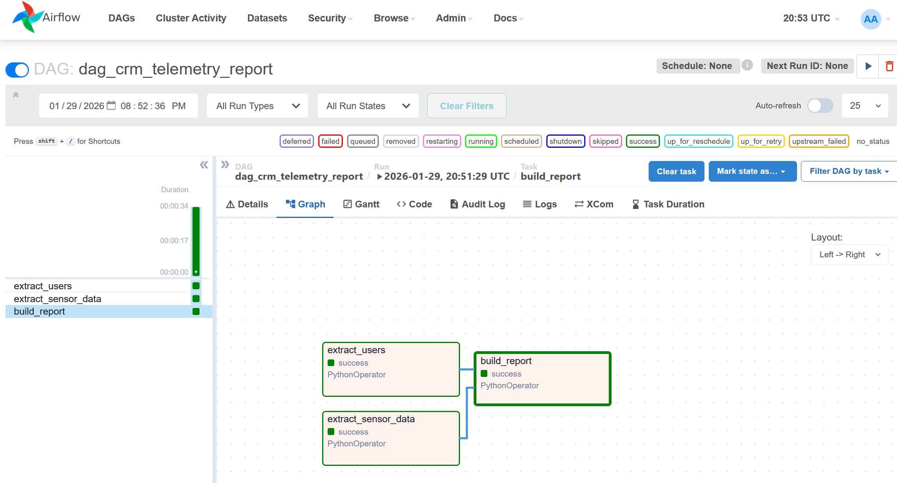

# architecture-bionicpro


## Схема решения для управления учётными данными пользователя




## Схема решения для подготовки и получения отчётов




##  Запуск проекта

```bash
chmod +x airflow/scripts/init-connections.sh
docker-compose up
```



